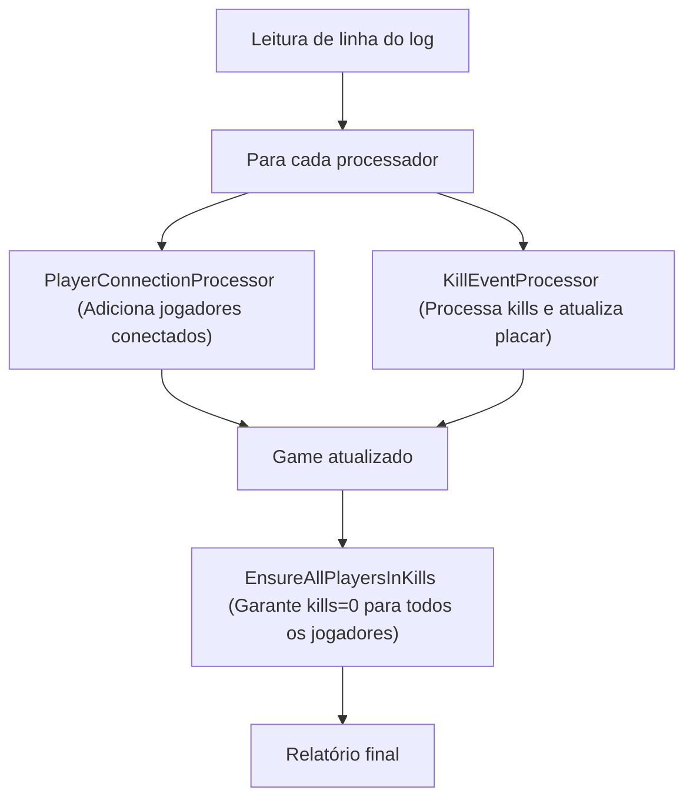

# Quake Log Parser

## Descrição

Este projeto é uma solução para o desafio de parser de logs do Quake 3 Arena. Ele lê o arquivo `games.log` gerado pelo servidor do jogo, processa os dados de cada partida e expõe uma API RESTful para consulta dos relatórios de jogos, incluindo total de kills, lista de jogadores e kills por jogador, seguindo todas as regras do desafio.

---

## Funcionalidades

- **Parser de log:** Lê e interpreta o arquivo `games.log`, agrupando eventos por partida.
- **Regras de negócio:**  
  - Quando `<world>` mata um player, ele perde -1 kill.
  - `<world>` não aparece na lista de jogadores nem no dicionário de kills.
  - `total_kills` inclui todas as mortes, inclusive as causadas por `<world>`.
- **API RESTful:** Exposição dos relatórios de jogos em formato JSON, com endpoint documentado via Swagger.
- **Testes unitários:** Cobertura dos principais fluxos e regras de negócio.
- **Documentação automática:** Swagger UI com descrições detalhadas dos endpoints.

---

## Como rodar o projeto

### 1. Pré-requisitos

- [.NET 8 SDK](https://dotnet.microsoft.com/download)
- (Opcional) Visual Studio 2022+ ou VS Code

### 2. Clone o repositório

```sh
git clone https://github.com/seu-usuario/QuakeLogParser.git
cd QuakeLogParser
```

### 3. Coloque o arquivo de log

Coloque o arquivo `games.log` na raiz do projeto ou ajuste o caminho conforme necessário.

### 4. Build e execução

```sh
dotnet build
dotnet run --project QuakeLogParser
```

A aplicação estará disponível em `https://localhost:5001` ou `http://localhost:5000`.

---

## Como usar a API

### 1. Acesse o Swagger

Abra o navegador em:
```
https://localhost:5001/swagger
```
ou
```
http://localhost:5000/swagger
```

### 2. Endpoint principal

- **GET** `/api/games/parse?filePath={CAMINHO_COMPLETO_DO_LOG}`

**Exemplo de uso:**
```
GET /api/games/parse?filePath=C:\Users\SeuUsuario\source\repos\QuakeLogParser\games.log
```

**Resposta:**
```json
{
  "game_1": {
    "total_kills": 45,
    "players": ["Dono da bola", "Isgalamido", "Zeh"],
    "kills": {
      "Dono da bola": 5,
      "Isgalamido": 18,
      "Zeh": 20
    }
  },
  ...
}
```

---

## Estrutura do Projeto

- `QuakeLogParser.Core`: Lógica de parsing, modelos e serviços.
- `QuakeLogParser`: Projeto da API (controllers, configuração).
- `QuakeLogParser.Tests`: Testes unitários.

---

## 📐 Arquitetura e Fluxo do Projeto

O projeto segue uma arquitetura em camadas, com separação clara entre controllers (API), services (orquestração do processamento), processors (processadores de eventos do log) e models (dados do jogo).

O processamento do log é feito por um pipeline: cada linha do log é lida e enviada para uma sequência de processadores, cada um responsável por um tipo de evento (ex: conexão de jogador, kills). Isso torna o sistema modular, fácil de manter e de estender.

As regras de negócio (como contagem de kills, tratamento de suicídios, exclusão do `<world>` da lista de jogadores) são aplicadas nos processadores e métodos utilitários.

A leitura do arquivo de log é feita por um componente separado, focado apenas em fornecer as linhas para o pipeline.

O projeto possui testes unitários para garantir a correta aplicação das regras e a robustez do parser.

---

### 🗺️ Diagrama do Pipeline



---

### ⚙️ Como funciona o pipeline
- Cada linha do log é processada por todos os processadores registrados.
- Cada processador executa sua lógica apenas se a linha for relevante para ele.
- O resultado é um objeto de jogo atualizado, pronto para ser exposto pela API.

---

### 📏 Principais regras de negócio
- `<world>` nunca aparece como jogador nem no dicionário de kills.
- Quando `<world>` mata um jogador, a vítima perde 1 kill.
- Suicídios (jogador mata a si mesmo) são ignorados (não alteram kills nem total_kills).
- O total de kills inclui apenas eventos válidos (não conta suicídios).
- Todos os jogadores conectados aparecem na lista de jogadores, mesmo que não matem ou morram.

---

### 🧩 Como adicionar novos processadores
- Crie uma nova classe que implemente a interface `ILogProcessor`.
- Implemente a lógica desejada no método `Processor`.
- Registre o novo processador no container de dependências (ex: `Program.cs`).
- O pipeline automaticamente irá processar cada linha do log com o novo processador.

---

### 🧪 Testes
- Os testes cobrem parsing, regras de negócio e cenários reais de log.
- Garantem que o parser funcione corretamente mesmo em casos de borda.
- Facilitam a evolução segura do projeto.

---

### 💡 Exemplo de uso real
**Entrada (trecho do log):**
```
20:37 InitGame: ...
20:38 ClientUserinfoChanged: 2 n\Isgalamido\t\0\model\uriel/zael...
20:54 Kill: 1022 2 22: <world> killed Isgalamido by MOD_TRIGGER_HURT
22:06 Kill: 2 3 7: Isgalamido killed Mocinha by MOD_ROCKET_SPLASH
```

**Saída esperada da API:**
```json
{
  "game_1": {
    "total_kills": 2,
    "players": ["Isgalamido", "Mocinha"],
    "kills": {
      "Isgalamido": 0,
      "Mocinha": 0
    }
  }
}
```

---

### 🏆 Boas práticas técnicas
- Projeto modular, fácil de manter e estender.
- Uso de injeção de dependência.
- Princípios do SOLID e inspiração em Clean Architecture.
- Testes automatizados para garantir robustez.

---

### 🧱 SOLID no projeto

O projeto aplica os princípios do SOLID:

- **S**ingle Responsibility: Cada classe/processador tem uma responsabilidade única (ex: processar kills, adicionar jogadores).
- **O**pen/Closed: Novos processadores podem ser adicionados sem modificar os existentes.
- **L**iskov Substitution: Todos os processadores implementam a mesma interface e podem ser trocados livremente.
- **I**nterface Segregation: Interfaces são pequenas e específicas (ex: `ILogProcessor`).
- **D**ependency Inversion: O pipeline depende de abstrações (interfaces), facilitando testes e extensibilidade.

---

### 🤝 Como contribuir
- Sugestões, melhorias e correções são bem-vindas!
- Para contribuir, abra uma issue ou envie um pull request.

---

## Testes

Para rodar os testes:

```sh
dotnet test
```

Os testes cobrem parsing, regras de negócio e integração básica.

---

## Contribuição

Pull requests são bem-vindos!  
Sugestões, melhorias e correções são sempre apreciadas.

---

## Licença

Este projeto é apenas para fins de avaliação técnica. 